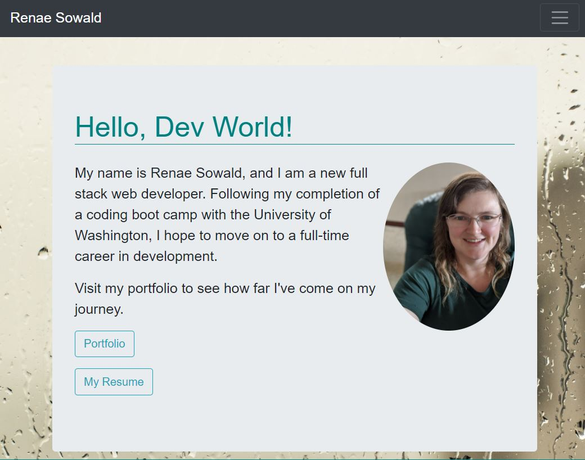

# React Portfolio

## Description

[Deployed Portfolio](https://rsowald.github.io/react_portfolio/)

This is my professional portfolio built with React. It features several of the applications I created over the course of coding boot camp and some samples of technical guides I have written.

## License

[MIT License](https://choosealicense.com/licenses/mit/)

## Contributing

As this is a professional portfolio, I am not accepting outside contributions.

## Questions

Contact me at renaesowald@gmail.com.
